# LayerOne

LayerOne is a physical side-channel security MVP for detecting abnormal
electrical behavior in an ESP32 workload and reporting the result through an
independent, authenticated LoRa path.

The demonstration uses two Raspberry Pi sensor nodes and one Raspberry Pi
receiver:

- **Solar Panel 1 / Raspberry Pi 1** captures live host health information and
  emits authenticated heartbeat packets.
- **Solar Panel 2 / Raspberry Pi 2** captures live Hantek/ACS measurements,
  learns a baseline, runs a two-sided CUSUM detector, and emits heartbeats plus
  real anomaly alerts.
- **Raspberry Pi 3** receives LoRa frames, verifies signatures, decrypts the
  payloads, rejects replays, stores accepted telemetry, and hosts the dashboard.

No synthetic alert generator is required. The included ESP32 firmware provides
a bounded, controlled workload for demonstrating an observable physical signal.

## Contents

```text
LayerOne/
├── README.md
├── .gitignore
├── esp32/
│   └── BlinkWifiAnomalyLab/
│       ├── BlinkWifiAnomalyLab.ino
│       └── README.md
├── detector/
│   ├── acs_scope_cusum.py
│   └── button_cusum_monitor.py
├── rpi1/
│   ├── README.md
│   ├── install.sh
│   ├── layerone-node.service
│   ├── layerone.py
│   └── node.json
├── rpi2/
│   ├── README.md
│   ├── install.sh
│   ├── layerone-node.service
│   ├── layerone.py
│   └── node.json
└── rpi3/
    ├── README.md
    ├── init_server_keys.py
    ├── install.sh
    ├── layerone-dashboard.service
    ├── layerone-server.service
    ├── layerone.py
    ├── server.json
    └── static/index.html
```

Runtime databases, private keys, logs, CSV captures, Python caches, and firmware
build products are intentionally excluded from this repository.

## Solution design

### System architecture

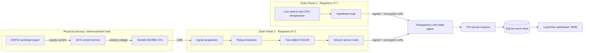

### MVP communication path and trust boundaries

The MVP sensor data path is **LoRa only**. The sensor nodes do not send
heartbeats, measurements, or alerts to Pi3 over Ethernet or Wi-Fi. SSH and file
copying are used only to install the software, while a browser is used only to
view Pi3's dashboard; neither is part of the LayerOne telemetry protocol.

The LoRa modules behave as transparent serial bridges. They transport bytes but
do not authenticate nodes, encrypt payloads, or decide whether an alert is
trusted. All security is applied end to end by the LayerOne software before a
frame reaches the transmitter and after it leaves the receiver.

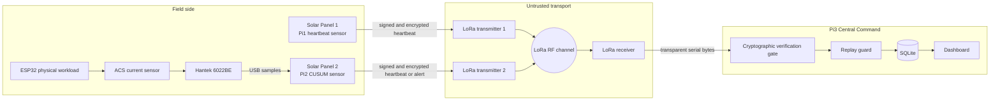

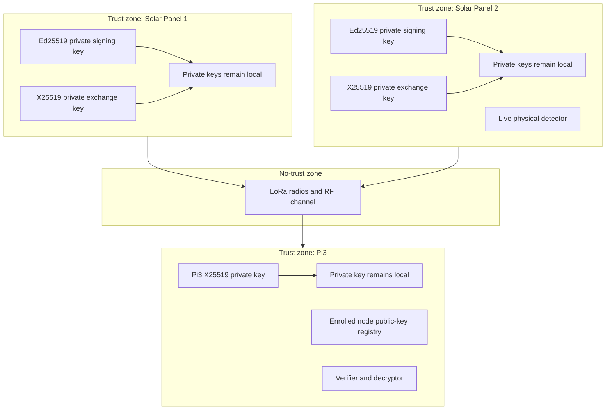

| Component | Live input | LoRa output | MVP role |
|---|---|---|---|
| Solar Panel 1 | Pi uptime and CPU temperature | Authenticated heartbeat | Availability sensor |
| Solar Panel 2 | Hantek/ACS electrical windows and Pi health | Authenticated heartbeat or CUSUM alert | Physical anomaly sensor |
| Pi3 | Transparent LoRa serial frames | None | Trust anchor, receiver, replay guard, database, dashboard |
| ESP32 | Keypad-controlled bounded workload | None | Controlled physical target |

### Raspberry Pi responsibilities

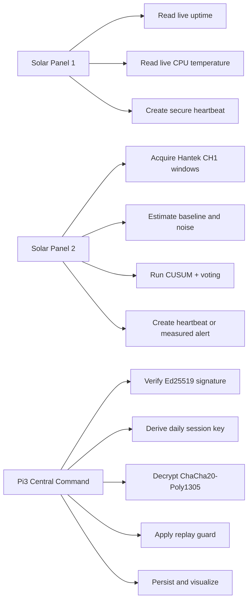

Solar Panel 1 reports `0` for supply voltage because no voltage ADC is attached;
zero means **unavailable**, not a measured zero-volt rail. Solar Panel 2 does the
same for Pi supply voltage while separately reporting live ACS measurements in
alert payloads.

## LayerOne LoRa cryptographic protocol

The radio link is treated as hostile. Anyone may be able to receive, copy,
delay, replay, corrupt, or inject LoRa bytes. A packet becomes trusted only
after Pi3 validates the complete LayerOne cryptographic chain.

### Long-term identities

Every sensor node creates two independent private keys:

| Key | Stored on | Purpose | Leaves the device? |
|---|---|---|---|
| Ed25519 private signing key | Its sensor node | Signs every transmitted frame | Never |
| Ed25519 public verification key | Pi3 registry | Lets Pi3 authenticate that node | Public only |
| X25519 node private key | Its sensor node | Computes the shared secret | Never |
| X25519 node public key | Pi3 registry | Lets Pi3 compute the same shared secret | Public only |
| X25519 Pi3 private key | Pi3 | Computes one shared secret per node | Never |
| X25519 Pi3 public key | Both sensor nodes | Lets each node compute its Pi3 shared secret | Public only |

Signing and key agreement are intentionally separate. Ed25519 proves which
enrolled node created a frame. X25519 creates key material for confidential
authenticated encryption. Reusing one key for both jobs would mix security
roles and make rotation and analysis harder.

### Trust bootstrap and node enrollment

Enrollment is the moment Pi3 binds a logical identity such as `sensor-rpi2` to
specific public keys. It is an operator-authorized, out-of-band action; it does
not happen automatically over the unauthenticated LoRa channel.

1. Pi3 creates its X25519 private key locally and prints only its public key.
2. Each sensor node creates its Ed25519 and X25519 private keys locally.
3. The Pi3 X25519 public key is copied into each node configuration.
4. Each node's two public keys are copied to the operator.
5. The operator runs the Pi3 `register` command with the expected node ID,
   location, coordinates, Ed25519 public key, and X25519 public key.
6. Pi3 stores this binding in the `nodes` table with status `active`.
7. A frame claiming that node number is accepted only if it verifies against
   the public keys in that enrollment record.

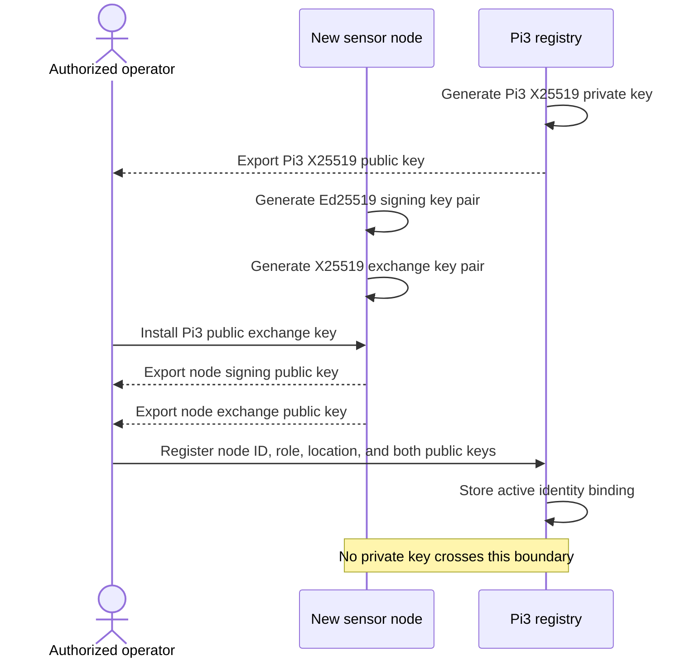

An attacker who merely transmits `node_number = 2` is not Solar Panel 2. The
claim becomes meaningful only when the Ed25519 signature verifies with Solar
Panel 2's enrolled public signing key and the ciphertext authenticates under
the key derived from its enrolled X25519 public key.

### Shared-key derivation

X25519 produces the same Diffie-Hellman secret on both sides:

```text
Node: shared_secret = X25519(node_private, Pi3_public)
Pi3:  shared_secret = X25519(Pi3_private, node_public)
```

The shared secret is never transmitted. It is passed through HKDF-SHA256 to
derive a 256-bit ChaCha20 key. The HKDF context includes the protocol name,
version, node number, and current day epoch:

```text
session_key = HKDF-SHA256(
    input_key_material = shared_secret,
    salt = none,
    info = "LayerOne/LoRa/v1/" || node_number || day_epoch,
    output_length = 32 bytes
)
```

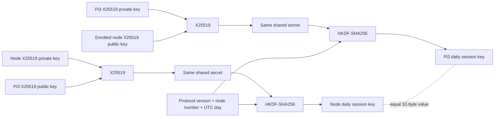

The UTC-day context provides deterministic key separation between days and
between nodes. This is useful key rotation, but it is **not full forward
secrecy**: compromise of a long-term X25519 private key and the corresponding
public key can reproduce keys for known epochs. A production design requiring
forward secrecy would add an authenticated ephemeral key exchange and a key
ratchet.

### Nonce construction and uniqueness

ChaCha20-Poly1305 requires a unique 96-bit nonce for every encryption under a
given key:

```text
nonce = day_epoch (32 bits) || random_boot_id (32 bits) || counter (32 bits)
```

- `day_epoch` selects the daily derived key context;
- `boot_id` is randomly generated every time the node process starts;
- `counter` begins at zero for that process and increases for every heartbeat
  or alert.

The random boot ID prevents ordinary process restarts from repeating a nonce
sequence during the same day. Pi3 also stores the complete
`node_id/epoch/boot/counter` tuple to reject replayed frames.

### Packet construction on a sensor node

The cleartext header contains routing and cryptographic context, not the sensor
measurement. It is encoded with the network-byte-order layout
`!2sBBBBIII`:

| Header field | Size | Meaning |
|---|---:|---|
| Magic | 2 bytes | `L1` protocol discriminator |
| Version | 1 byte | Protocol version |
| Kind | 1 byte | Heartbeat or alert |
| Node number | 1 byte | Index used to resolve the enrolled identity |
| Key version | 1 byte | Key-generation identifier |
| Day epoch | 4 bytes | HKDF context and nonce component |
| Boot ID | 4 bytes | Random process-session identifier |
| Counter | 4 bytes | Monotonic packet sequence |

The node then performs these operations in order:

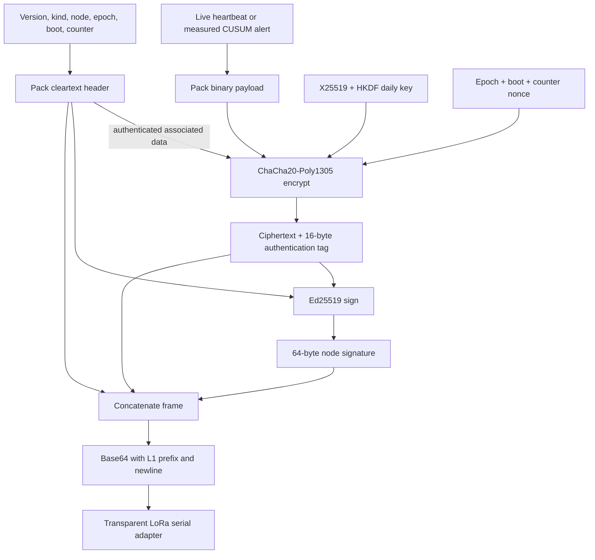

Conceptually, the transmitted line is:

```text
"L1:" || Base64(
    header ||
    ChaCha20Poly1305(session_key, nonce, payload, AAD=header) ||
    Ed25519Sign(node_signing_private, header || ciphertext_and_tag)
) || "\n"
```

The Ed25519 signature covers the cleartext header and the encrypted payload,
including its Poly1305 tag. Changing the node number, counter, message kind, or
ciphertext invalidates the signature.

### Heartbeat and alert payloads

A heartbeat carries protocol payload version, live uptime, live CPU
temperature, and the available supply-voltage field. An alert additionally
carries:

- severity;
- physical detection time;
- random event reference;
- latitude and longitude;
- measured ACS mean in millivolts;
- learned baseline in millivolts;
- measured delta in millivolts;
- CUSUM score.

These alert measurements are produced before encryption by Solar Panel 2's
physical detector. Pi3 decrypts and displays them; it does not invent them.

### Verification pipeline on Pi3

Pi3 treats every received line as untrusted input. Acceptance follows a
fail-closed sequence:

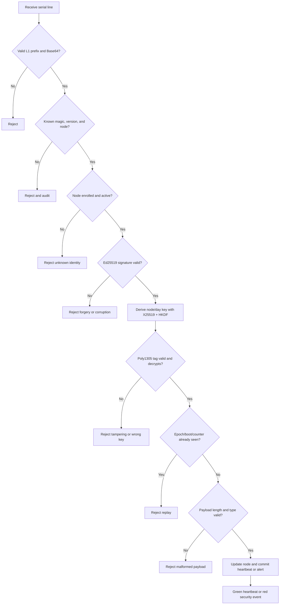

The replay tuple is inserted under a unique database constraint. A repeated
valid packet therefore cannot create a second event or refresh node state.

### Why alerts are attributable

```mermaid
flowchart LR
    DET[CUSUM condition on Solar Panel 2] --> PAYLOAD[Measured alert payload]
    PAYLOAD --> ENC[Encrypt for Pi3]
    ENC --> SIGN[Sign with Solar Panel 2 private Ed25519 key]
    SIGN --> RF[Untrusted LoRa channel]
    RF --> VERIFY[Verify with enrolled Solar Panel 2 public key]
    VERIFY --> DECRYPT[Authenticate and decrypt with derived shared key]
    DECRYPT --> REPLAY[Pass replay guard]
    REPLAY --> EVENT[Attributed verified event in Pi3]
```

The dashboard's red warning means Pi3 received a new alert that passed this
chain. It does not mean LayerOne has conclusively classified malware; it means
the enrolled physical sensor reported statistically significant behavior that
requires investigation.

### Security properties and limits

| Threat | LayerOne response |
|---|---|
| Passive LoRa eavesdropping | Measurement payload remains encrypted with ChaCha20-Poly1305 |
| Frame modification | Ed25519 signature and Poly1305 tag fail |
| Node impersonation without keys | Signature verification fails |
| Replay of a captured valid frame | Unique epoch/boot/counter database constraint rejects it |
| Packet from an unenrolled node | Active-node registry lookup rejects it |
| Cross-node packet substitution | Node-specific public keys and HKDF node context prevent acceptance |
| Database/UI fabrication | Outside the LoRa protocol; protect Pi3 and its operator access |
| RF jamming or packet deletion | Detectable as missing heartbeats, but not prevented |
| Traffic analysis | Header and transmission timing remain visible |
| Node private-key compromise | Attacker may impersonate that node until it is revoked and re-enrolled |
| Pi3 X25519 private-key disclosure | Recorded and future payload confidentiality is compromised; node signatures still prevent forgery without a node's Ed25519 private key |

The MVP provides application-layer confidentiality, integrity, authenticity,
node attribution, and replay resistance over an untrusted transparent radio.
It does not claim anti-jamming, anonymous routing, hardware-backed key storage,
or forward secrecy.

## Physical detection and CUSUM mathematics

The Hantek samples the ACS sensor output on CH1. Each acquisition window is
converted to millivolts and reduced to a 1% trimmed mean, which limits the
influence of isolated capture spikes.

### Baseline estimation

During startup, Solar Panel 2 captures quiet windows while the ESP32 is in its
normal state. The baseline center is the median:

```text
μ = median(x₁, x₂, …, xₙ)
```

Noise is estimated robustly from the median absolute deviation:

```text
MAD = median(|xᵢ − μ|)
```

```text
σ = max(1.4826 × MAD, σ_floor)
```

The default noise floor is `0.10 mV`.

### Two-sided CUSUM

For each new window `x_t`, the detector accumulates positive and negative
deviation separately:

```math
S_t^+ = \max(0,\ S_{t-1}^+ + (x_t - \mu) - k)
```

```math
S_t^- = \max(0,\ S_{t-1}^- + (\mu - x_t) - k)
```

with:

```math
k = k_{\sigma}\sigma, \qquad h = h_{\sigma}\sigma
```

Defaults are `k_sigma = 0.5` and `h_sigma = 5.0`. A cumulative excursion must
cross `h`, but threshold crossing alone does not create an alert.

### Sustained-window voting

The detector also requires at least three of the latest five windows to exceed:

```math
\Delta_{trigger} = \max(3\sigma,\ 5.0\text{ mV})
```

This rejects the ESP32's normal one-second LED heartbeat, which typically
affects only two 500 ms observation windows. A real alert therefore requires
both cumulative CUSUM evidence and a sustained physical shift.

After an alert, six consecutive readings inside the recovery band re-arm the
detector:

```math
|x_t - \mu| \leq \max(3\sigma,\ 0.5\text{ mV})
```

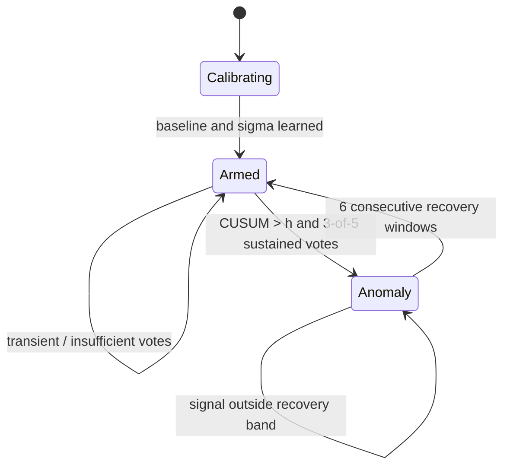

The transmitted alert contains the real measured mean, learned baseline,
measured delta, CUSUM score, detection timestamp, event reference, and node
coordinates. Pi3 does not fabricate these values.

## Hardware

Minimum lab hardware:

- 1 ESP32 development board;
- 1 4x4 membrane keypad or momentary contact;
- 1 LED and 330-ohm resistor if the board does not provide a suitable LED;
- 1 ACS current sensor appropriate for the measured current range;
- 1 Hantek 6022BE oscilloscope;
- 3 Raspberry Pi systems;
- 3 compatible transparent USB LoRa serial adapters (two transmitters, one
  receiver), configured to the same radio parameters;
- isolated, current-limited bench power and suitable USB cables.

### ESP32 keypad connections

For keypad key `1`:

| Signal | ESP32 pin |
|---|---:|
| Key-1 row contact | GPIO4 |
| Key-1 column contact | GPIO18 |
| LED / scope marker | GPIO19 |

The firmware drives GPIO4 low and reads GPIO18 with `INPUT_PULLUP`. Do not wire
the keypad contact directly to ground. Keep the key released while booting.

### Measurement path

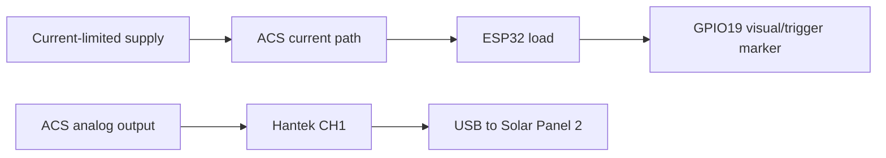

Follow the ACS and Hantek manufacturers' voltage, current, grounding, and
isolation limits. Do not connect oscilloscope ground to an unsafe potential.

## Software prerequisites

The install scripts target Debian/Raspberry Pi OS and assume the deployment user
is `russo` with `/home/russo/layerone` as the runtime directory. If another user
is used, update the JSON files, install scripts, and systemd units first.

Packages installed by the scripts include:

- Python 3;
- `python3-serial`;
- `python3-cryptography`;
- `python3-flask` on Pi3;
- `sigrok-cli` and `sigrok-firmware-fx2lafw` on Solar Panel 2.

The ESP32 build requires Arduino CLI with the Espressif ESP32 board package.

## Fresh deployment

Deploy Pi3 first, then the two sensor nodes. This order ensures the Pi3 public
exchange key is available before node configuration.

### 1. Configure serial devices

On each Pi, identify the USB device:

```bash
lsusb
ls -l /dev/ttyACM* /dev/ttyUSB*
```

The example configs use `/dev/ttyACM0` at `115200`. Update `serial_port` if the
adapter enumerates differently. For permanent installations, create a udev
rule and use a stable symlink rather than relying on enumeration order.

### 2. Install Pi3 Central Command

Copy `rpi3/` to Pi3, then run:

```bash
cd rpi3
chmod +x install.sh
./install.sh
```

The installer creates or preserves:

```text
/home/russo/layerone/keys/server/exchange.key
```

Print the Pi3 public exchange key:

```bash
python3 /home/russo/layerone/init_server_keys.py
```

Copy this Base64 public value into `server_exchange_public` in both
`rpi1/node.json` and `rpi2/node.json`. Never copy the Pi3 private key.
The packaged JSON intentionally contains a placeholder and will not start a
node successfully until this value is replaced.

Check Pi3:

```bash
systemctl status layerone-server layerone-dashboard --no-pager
journalctl -u layerone-server -f
curl -s http://127.0.0.1:8090/api/overview
```

### 3. Install Solar Panel 1

Copy `rpi1/` to Raspberry Pi 1 after updating the Pi3 public key:

```bash
cd rpi1
chmod +x install.sh
./install.sh
```

The node creates private Ed25519 and X25519 keys under:

```text
/home/russo/layerone/keys/sensor-rpi1/
```

The installer prints the two public values needed for enrollment. To print them
again:

```bash
python3 /home/russo/layerone/layerone.py bootstrap \
  --key-dir /home/russo/layerone/keys/sensor-rpi1
```

Verify live heartbeat transmission:

```bash
systemctl status layerone-node --no-pager
journalctl -u layerone-node -f
```

Expected output includes:

```text
heartbeat sent counter=... bytes=...
```

### 4. Install Solar Panel 2

Connect the Hantek and LoRa adapter. Confirm the Hantek before installation:

```bash
lsusb
sigrok-cli --scan
sigrok-cli --driver hantek-6xxx --show
```

Copy `rpi2/` to Raspberry Pi 2 after updating the Pi3 public key:

```bash
cd rpi2
chmod +x install.sh
./install.sh
```

The installer adds the user to `dialout` and `plugdev`. A logout/login or reboot
may be required for new group membership to apply.

Print the public enrollment values again if required:

```bash
python3 /home/russo/layerone/layerone.py bootstrap \
  --key-dir /home/russo/layerone/keys/sensor-rpi2
```

Watch calibration and live acquisition:

```bash
journalctl -u layerone-node -f
```

Expected startup sequence:

```text
CUSUM calibration: collecting 16 live scope windows
baseline 01/16 mean=... mV
...
CUSUM armed: baseline=... mV sigma=... mV
heartbeat sent counter=... bytes=...
scope mean=... delta=... cusum+=... cusum-=... state=ARMED
```

Keep the ESP32 in its quiet state throughout calibration.

### 5. Enroll both nodes on Pi3

Use only the public values printed by each node.

Solar Panel 1:

```bash
python3 /home/russo/layerone/layerone.py register \
  --database /home/russo/layerone/data/central-command.db \
  --node-id sensor-rpi1 \
  --location "Solar Panel 1" \
  --latitude 52.2297 \
  --longitude 21.0122 \
  --signing-public 'PASTE_PI1_ED25519_PUBLIC_KEY' \
  --exchange-public 'PASTE_PI1_X25519_PUBLIC_KEY'
```

Solar Panel 2:

```bash
python3 /home/russo/layerone/layerone.py register \
  --database /home/russo/layerone/data/central-command.db \
  --node-id sensor-rpi2 \
  --location "Solar Panel 2" \
  --latitude 52.2321 \
  --longitude 21.0180 \
  --signing-public 'PASTE_PI2_ED25519_PUBLIC_KEY' \
  --exchange-public 'PASTE_PI2_X25519_PUBLIC_KEY'
```

Restart the receiver:

```bash
sudo systemctl restart layerone-server
```

### 6. Open the dashboard

```text
http://192.168.0.198:8090/
```

Normal behavior:

- a fresh heartbeat is green;
- an offline node is gray;
- red is reserved for a real accepted alert;
- the audit list shows verified heartbeat packets;
- an incoming CUSUM alert opens a prominent potential-cyberattack dialog with
  measured value, baseline, delta, CUSUM score, source, severity, and time.

`heartbeat_only_nodes` in `rpi3/server.json` can enforce a heartbeat-only policy
for selected nodes. The supplied configuration applies this to `sensor-rpi1`.

## Build and flash the ESP32 workload target

Install the ESP32 Arduino core, then compile:

```bash
arduino-cli compile \
  --fqbn esp32:esp32:esp32 \
  esp32/BlinkWifiAnomalyLab
```

Find the board port:

```bash
arduino-cli board list
```

Upload, replacing the port if necessary:

```bash
arduino-cli upload \
  --fqbn esp32:esp32:esp32 \
  --port /dev/ttyUSB0 \
  esp32/BlinkWifiAnomalyLab
```

Monitor serial labels:

```bash
arduino-cli monitor \
  --port /dev/ttyUSB0 \
  --config baudrate=115200
```

The firmware starts in a safe baseline state. Press keypad key `1` once to run
one bounded eight-second anomaly cycle. The cycle stops automatically or when
the internal temperature reaches 75 °C.

## Execute the end-to-end demonstration

1. Power the ESP32, Hantek, LoRa adapters, and all three Pis.
2. Confirm Pi3 receiver and dashboard services are active.
3. Confirm Solar Panel 1 produces verified heartbeats.
4. Keep the ESP32 quiet while Solar Panel 2 calibrates.
5. Wait for `CUSUM armed` in the Solar Panel 2 journal.
6. Open the Pi3 dashboard and confirm both nodes are green.
7. Press keypad key `1` once.
8. Observe a sustained electrical shift in the Solar Panel 2 journal.
9. Confirm Pi3 accepts the signed/encrypted alert.
10. Inspect the red dashboard popup and its measured fields.
11. Wait for six recovery windows and confirm the detector re-arms.

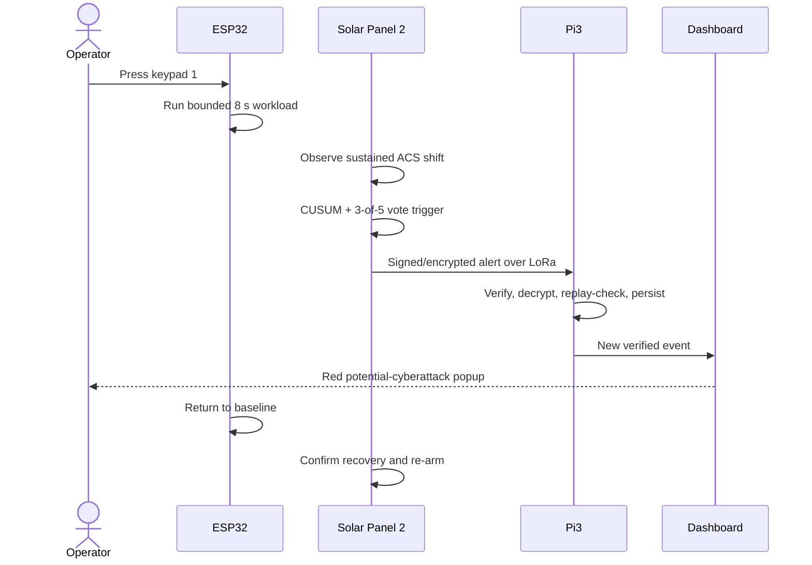

## Optional workstation detector

The `detector/` scripts provide a foreground detector for bench diagnostics.
Close OpenHantek first because only one process can own the scope.

```bash
cd detector
python3 -u button_cusum_monitor.py
```

This utility writes a local CSV unless `--log` is changed. CSV files are ignored
by Git.

For a longer generic experiment:

```bash
python3 detector/acs_scope_cusum.py \
  --baseline-seconds 120 \
  --log cusum_log.csv
```

## Operations

### Service status

Sensor nodes:

```bash
systemctl status layerone-node --no-pager
journalctl -u layerone-node -f
```

Pi3:

```bash
systemctl status layerone-server layerone-dashboard --no-pager
journalctl -u layerone-server -f
journalctl -u layerone-dashboard -f
```

### Restart and recalibrate Solar Panel 2

Restarting the service starts a new baseline calibration:

```bash
sudo systemctl restart layerone-node
journalctl -u layerone-node -f
```

Do this only while the measured target is in its known normal state.

### Foreground diagnosis

```bash
sudo systemctl stop layerone-node
python3 /home/russo/layerone/layerone.py node \
  --config /home/russo/layerone/node.json
```

Restore managed operation afterward:

```bash
sudo systemctl start layerone-node
```

### Dashboard API

```bash
curl -s http://127.0.0.1:8090/api/overview | python3 -m json.tool
```

The API returns node health, recent verified events, recent packet audit rows,
and receiver metadata.

## Troubleshooting

### Node is offline

1. Check power and network reachability.
2. Check `systemctl status layerone-node`.
3. Verify the LoRa adapter path and `dialout` membership.
4. Inspect `journalctl -u layerone-node -n 100`.
5. Confirm the transmitter and receiver use the same baud/radio settings.
6. Confirm Pi3 has enrolled the correct public keys.

### Hantek is unavailable

```bash
sigrok-cli --scan
sigrok-cli --driver hantek-6xxx --show
```

- close OpenHantek or any competing sigrok process;
- unplug/reconnect the scope;
- confirm `sigrok-firmware-fx2lafw` is installed;
- confirm the service user belongs to `plugdev`;
- inspect USB permissions with `lsusb` and `ls -l /dev/bus/usb/...`.

### LoRa serial port changed

```bash
ls -l /dev/ttyACM* /dev/ttyUSB*
python3 -m serial.tools.list_ports -v
```

Update `serial_port` in the node or server JSON and restart the service.

### Pi3 rejects packets

Check the packet audit and server journal. Common reasons are:

- node not enrolled or inactive;
- node public key changed after reinstallation;
- wrong Pi3 exchange public key in a node config;
- duplicate epoch/boot/counter tuple;
- damaged Base64 frame;
- invalid signature or AEAD authentication tag.

### False positives

- recalibrate with a genuinely quiet load;
- improve ACS grounding and USB noise control;
- increase `trigger_floor_mv`, `h_sigma`, or `votes_required` carefully;
- do not reduce thresholds merely to force a demonstration;
- compare normal operating modes before choosing production thresholds.

### No alert during the controlled test

- confirm Solar Panel 2 reports `state=ARMED`;
- confirm the keypad wiring and ESP32 serial phase labels;
- ensure CH1 measures the ACS output rather than the trigger pin;
- verify the workload shift exceeds `trigger_floor_mv` for at least three of five
  windows;
- inspect actual `mean`, `delta`, and CUSUM journal values before retuning.

## Data and key handling

Never commit or copy these runtime paths into the repository:

```text
/home/russo/layerone/keys/
/home/russo/layerone/data/
```

Recommended backup policy:

- back up Pi3's database and server private key to encrypted offline storage;
- back up each node's private keys separately;
- never consolidate all private keys on one machine;
- use file mode `0600` for private keys and JSON containing operational data;
- rotate and re-enroll a node if its private key may have been exposed.

The dashboard is an MVP display and does not add TLS or user authentication by
itself. For the HackYeah demo, expose port `8090` only to the presentation
machine. A production deployment must add authenticated access and transport
security; those controls are outside this MVP.

## Publish to GitHub

Review the tree before publishing:

```bash
find . -type f | sort
git status --short
```

Create a new repository history:

```bash
git init
git add .
git commit -m "Initial LayerOne MVP release"
git branch -M main
git remote add origin git@github.com:YOUR_ACCOUNT/LayerOne.git
git push -u origin main
```

Git records the commit date and file contents. It does not preserve ordinary
filesystem creation times. Do not add runtime keys, databases, logs, or build
artifacts to manufacture project history.

## Safety and scope

The included ESP32 workload is a controlled defensive demonstration. It has no
exploit, propagation, persistence, credential access, or external attack target.
Run it only on owned lab equipment with suitable current limiting, thermal
monitoring, and electrical isolation.
